# Smart Planter Guide

**Guilherme A. Ribeiro, Hao Li, Mo Rastgaar**

**Human-Interactive Robotics Laboratory (HIRoLab), Michigan Tech, Houghton, MI, USA**

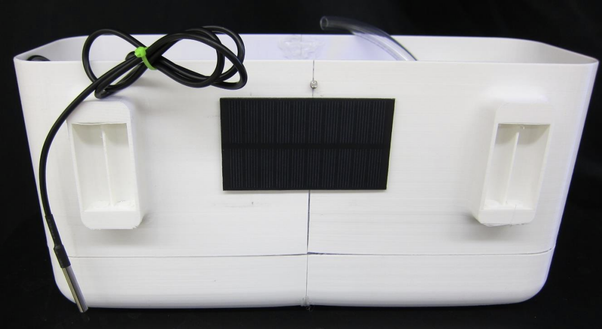

## Initial Configuration

Execute steps 1-7 every time you are connecting
the Smart Planter to a new network. After initial
setup, network configuration will remain in
memory.

1. Turn on master switch (A)
2. If the battery activity light (C) or the power
    bus light (D) does not turn on, press
    bootstrap button (B)

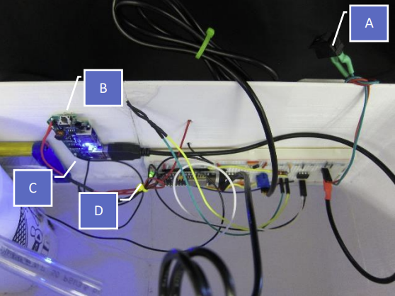

3. Connect any wireless capable device to the
    planter network (SmartPlanter0001)

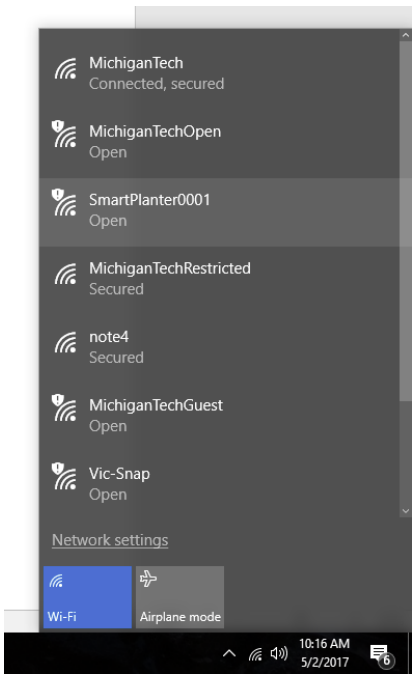

4. If a login window does not open
    automatically on your browser, access
    [http://192.168.4.1/](http://192.168.4.1/)

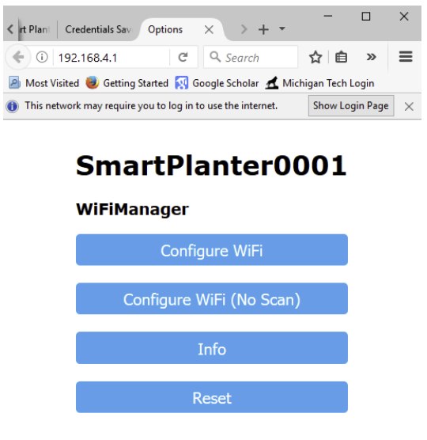

5. Enter login and password credentials of
  your home network

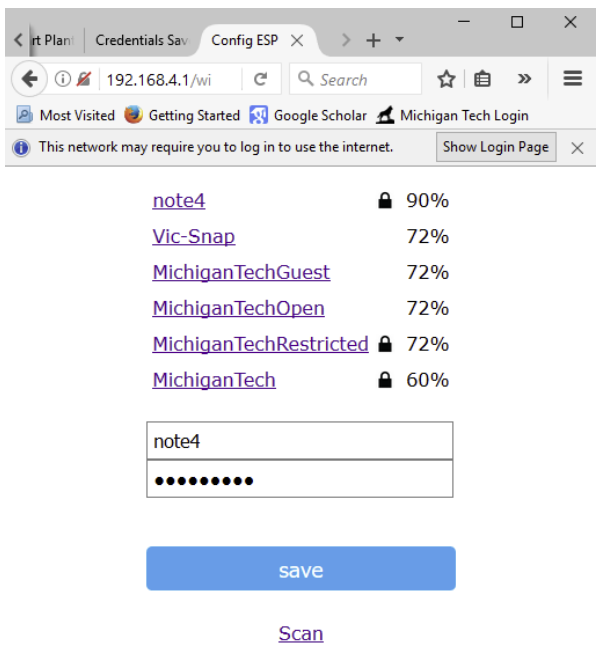

6. Wait a few minutes for the Smart Planter to
  login (there is no completion warning)

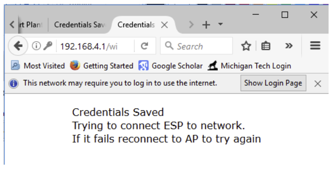

7. The planter will close the SmartPlanter
  network and connect to the home network.
  If data on the cloud is not updated, reset
  the device (turn the master switch on and
  off)

## Visualization on a browser

Each Smart Planter has a measurement channel
(https://thingspeak.com/channels/264988) and
a command channel
(https://thingspeak.com/channels/266364)

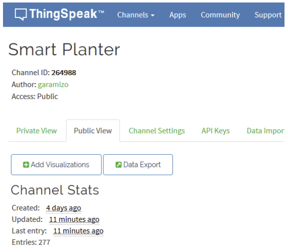

Thingspeak interface.

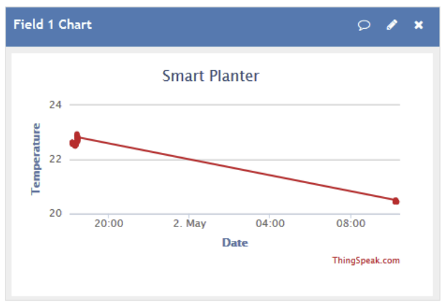

## Visualization and control on a smartphone app

Install SmartPlanter.apk on your mobile device.

The app can (1) request a new pump cycle
period, and (2) visualize planter state: soil
temperature, environment brightness, pump
cycle period, and water container level.

To update planter state, press button “Update”.

To command new pump cycle period, adjust
slider to desired value, and press “Apply”. Once
the IoT server receives the command, the update
time is displayed at the bottom of the screen.

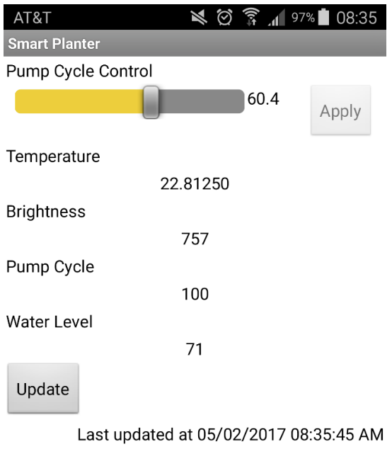

## System Components

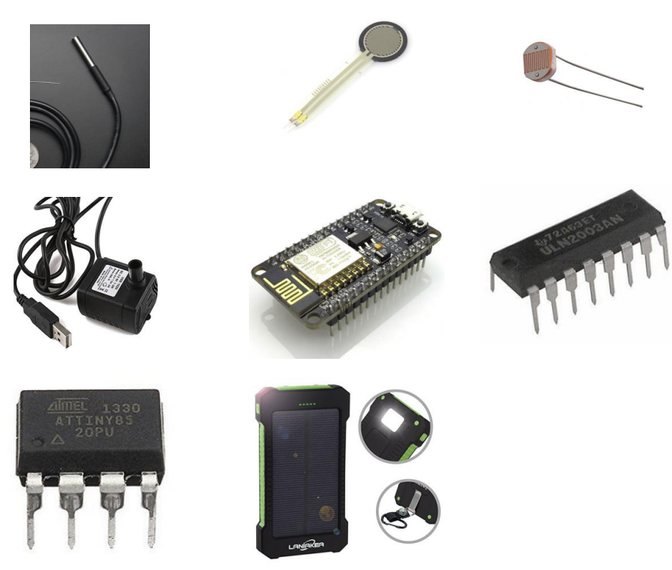

Temperature sensor (Gikfun DS18B20), Water level sensor (Force sensing resistor), Brightness sensor
(Photoresistor GL5537), Water Pump (Drew 3W), IoT Microcontroller (HiLetGo NodeMCU ESP8266),
Motor driver IC (ULN 2003), Secondary Microcontroller (Atmel AtTiny85), Solar phone charger (Laniakea
10000mAh)

Obs 1 : The force sensitive resistor was placed on the base of the cup to measure the weight of the water,
proportional to the water container level. This sensor is expensive ($10), but there are cheaper solutions
(eg. vertical float switch).

Obs 2: The ESP8266 cannot measure both the water level and light sensor because the microcontroller
has only one analog read channel. We added a second inexpensive microcontroller (Atmel AtTiny85) to
measure the second analog channel and communicate with ESP8266 via PWM communication.

Obs 3: There is a 54 Ohm resistor drawing current from the 5V channel. This extra current is necessary so
that the Power manager does not shut off the 5V channel. The Power manager has this feature to decrease
current leakage.

## System Map

The Smart Planter, connected to a home network with internet access, publish its state and reads its
desired pump operation to/from an Internet of Things (IoT) server (ThingSpeak). The 4 system states, (1)
soil temperature, (2) environment brightness, (3) water container level, and (4) pump cycle period, are
updated to a IoT channel (id: 264988 ). The pump cycle period is the time the pump rests between the 5
second operation time. That is, the pump is on for 5 seconds, turns off for “pump cycle period”, and
repeat. This state is adjusted by another IoT channel (id: 266364 ). And this channel can be accessed
through the SmartPlant app.

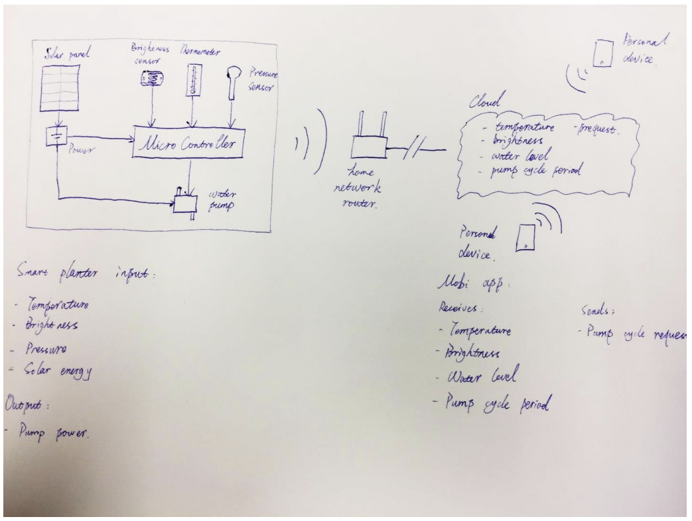

## Electrical diagram

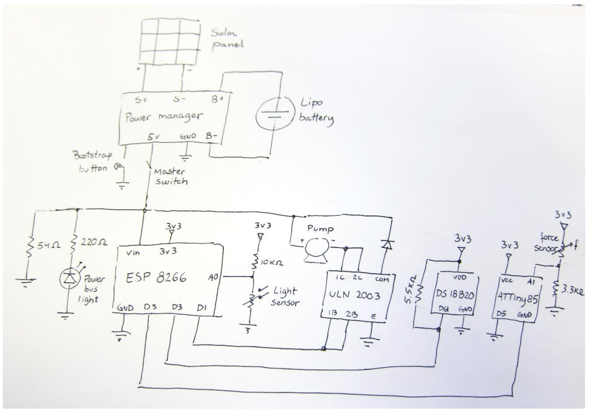

Electrical diagram

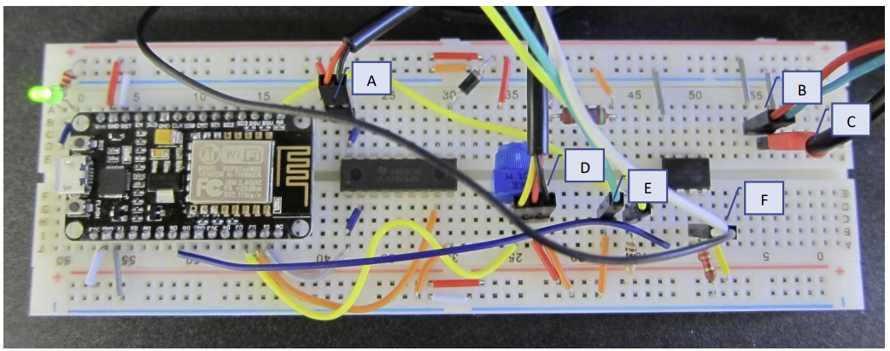

Connections: Pump (A), master switch (B), power supply (C), temperature sensor (D), brightness sensor
(E), water level sensor (F).

## App Development and Installation

The app was developed with MIT App Inventor (http://appinventor.mit.edu/explore/). The project (.aia)
and the mobile executable (.apk) are attached.

